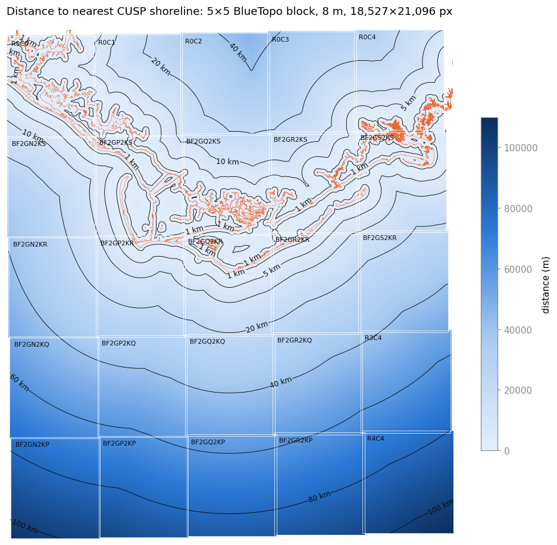

# coastal-distance

Distance-to-shoreline rasters on NOAA **BlueTopo** grids: every pixel holds the distance (metres) from its centre to the
nearest NOAA **CUSP** shoreline.



## Notebooks

| Notebook | What it does |
|---|---|
| [`coastal_distance_methods.ipynb`](coastal_distance_methods.ipynb) | Compares ways to compute the grid on one 8 m tile (`BF2GS2KS`, Alligator Point, FL): brute force, 1-D marching, chamfer two-pass, exact EDT (Felzenszwalb–Huttenlocher, numba), `scipy.ndimage`, KD-tree, and **vector dead reckoning with halo seeding and refinement**. Includes benchmarks, error maps and animations. |
| [`coastal_distance_mosaic.ipynb`](coastal_distance_mosaic.ipynb) | Scales the recommended method to a **5 × 5 block** of tiles (≈150 × 170 km, 391 Mpx): one shared shoreline index, tiles computed in parallel, stitched without resampling, plus a seam check against a naive per-tile approach. |
| [`coastal_distance_national_plan.ipynb`](coastal_distance_national_plan.ipynb) | **Plans (does not run)** the national grid: all US waters 0–50 m deep (CONUS, Great Lakes, Alaska, Hawaii), clipped to the EEZ. Gives tile counts, pixel counts, download sizes and a run-time estimate, and writes a tile manifest. |

`shoredist.py` holds the production method (numba kernels release the GIL, so tiles run in parallel threads).

## Results so far

* **Single tile (15.8 Mpx):** vector dead reckoning, 3.9 s, **2 mm mean error** vs exact vector distance, with no padding needed.
  The exact raster EDT (numba, parallel) takes 0.26 s but is limited to ±5.7 m by rasterising the shoreline.
* **5 × 5 mosaic (391 Mpx):** 85 s on 8 threads (Apple M4). Neighbouring tiles agree to 0.09 mm on average in their
  overlaps; the naive per-tile approach is off by 2.7 km on average.
* **National plan (0–50 m):** 7,534 tiles, about 45 Gpx; about **3 h** on one M4 Mac mini, under 1 h on a 64-vCPU node (assumed speed).
  BlueTopo has no tiles yet in Hawaii or Alaska west of about 138° W, so those areas use BlueTopo-style synthetic 0.3° / 8 m cells.

## Setup

```bash
python3 -m venv .venv
.venv/bin/pip install -r requirements.txt
.venv/bin/jupyter lab
```

Tested with Python 3.9 on macOS (Apple silicon). The notebooks download what they need into `data/` (BlueTopo tiles and tile
scheme, CUSP shoreline packages, ETOPO 2022 subsets, NOAA maritime limits): about 1 GB for everything. Run
`coastal_distance_methods.ipynb` first. Large outputs (GeoTIFFs) are written to `outputs/` and are not tracked in git.

## Data sources (all NOAA, public)

* BlueTopo, NOAA Office of Coast Survey: <https://registry.opendata.aws/noaa-bathymetry>, <https://nauticalcharts.noaa.gov/data/bluetopo_specs.html>
* CUSP shoreline, NOAA National Geodetic Survey: <https://nsde.ngs.noaa.gov/>, <https://shoreline.noaa.gov/data/datasheets/cusp.html>
* ETOPO 2022, NOAA NCEI (via CoastWatch ERDDAP): <https://coastwatch.pfeg.noaa.gov/erddap/info/ETOPO_2022_v1_15s/index.html>
* U.S. Maritime Limits & Boundaries, NOAA Office of Coast Survey: <https://nauticalcharts.noaa.gov/data/us-maritime-limits-and-boundaries.html>
